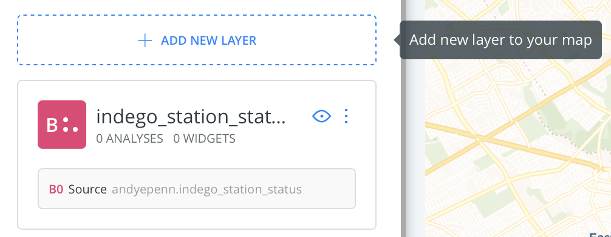

# Spatial Databases

## Lecture

* [Slides](https://docs.google.com/presentation/d/1XjNaSRGnhfcnWKLIfF0E0zBOctxkxjTMoUN2Ogy3xy8/edit?usp=sharing)
* Follow along demo
  * [Dates practice](#dates-follow-along)
  * [Mapping with PostGIS](https://github.com/MUSA-509/week-2-digging-into-databases#mapping-follow-along)

### Outline

* Housekeeping
  - Office Hours - [OHQ](https://ohq.io) and office hour times
  - Updates to Syllabus
  - Homework via GitHub classroom (check class Canvas page for link to assignment)
* Introduction to databases
* PostgreSQL
* Review of SQL queries
  - Keywords (SELECT, FROM, LIMIT, WHERE, GROUP BY, ORDER BY)
  - Anatomy of a SQL query
  - Data types
  - Date type follow along
  - Documentation
* Spatial SQL (PostGIS)
  - Geometry data type (points, lines, polygons, other)
  - What you can do with geometry / functions available
  - Mapping follow along
* Structure of CARTO, a web application
* Homework

### Dates Follow Along

1. Date Parsing
  ```SQL
   SELECT to_timestamp('April 1, 2020', 'Month DD, YYYY')
   ```
2. Getting a timestamp type from a date and time
  ```SQL
  SELECT to_timestamp('2020/04/01 18:37:14',
                     'YYYY/MM/DD HH24:MI:SS')
  ```
3. Casting from a string:
  ```SQL
  SELECT '2020-09-08'::date
  ```
4. Parse a human readable date string to a date type:
  ```SQL
  SELECT to_date('08 Sep 2020', 'DD Mon YYYY')
  ```
5. Extracting part of a date:
  ```SQL
  SELECT
    EXTRACT(month from '2020-09-08'::date) as date_month,
    EXTRACT(day from '2020-09-08'::date) as date_day,
    EXTRACT(year from '2020-09-08'::date) as date_year
  ```

### Mapping Follow Along

1. Create a new map with the Station Status data
2. Add it as a new Layer
  
3. Add it as a new Layer __again__
4. Choose one Layer and add this SQL to it, **making sure to update your username/schema instead of mine**:
  ```SQL
    SELECT
      the_geom,
      ST_Transform(the_geom, 3857) as the_geom_webmercator,
      1 as cartodb_id
    FROM (
      SELECT ST_MakeLine(the_geom) as the_geom
      FROM andyepenn.indego_station_status
    ) as _w
  ```
5. Choose another Layer and add this SQL to it, **again making sure to change the username/schema for the table**:
  ```SQL
    SELECT
      the_geom,
      ST_Transform(the_geom, 3857) as the_geom_webmercator,
      1 as cartodb_id
    FROM (
      SELECT ST_ConvexHull(ST_Collect(the_geom)) as the_geom
      FROM andyepenn.indego_station_status
      ) as _w
  ```
  A [convex hull](https://en.wikipedia.org/wiki/Convex_hull) is a bounding shape that minimally encompasses all the external points/lines/polygons, kind of like a rubber band around your fingers.

6. Play around with the queries. You can add an `ORDER BY column` in the `ST_MakeLine` function. Try out `ST_MakeLine(the_geom ORDER BY id)`, `ST_MakeLine(the_geom ORDER BY addresszipcode)`, `ST_MakeLine(the_geom ORDER BY random())`. Yes, that's a weird spot for the `ORDER BY`. Also, something weird happens with the `random()` one. Can you spot it?

7. Does changing the order of the query affect the Convex Hull?


## Homework

**Due by Sept 15, 11:59pm ET via GitHub classroom**

Submit [Homework 1](https://github.com/MUSA-509/week-2-digging-into-databases/blob/master/homework-1.md) through GitHub classroom. Check our class Canvas page announcements for the signup link.

Note: You need a GitHub account to complete the assignment. If you are unfamiliar with it, please ask Andy or Felix for assistance. Thursday's Lab will have a 10-15 minute portion on GitHub.

## Lab

* Posted soon

## Resources

* [PostGIS documentation](https://postgis.net/docs/manual-3.0/reference.html)
